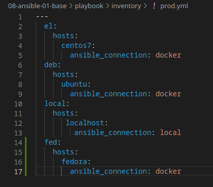
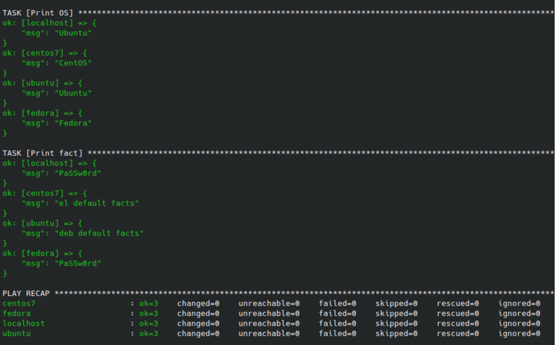

## "08.01 Введение в Ansible"

Необязательная часть
* При помощи ansible-vault расшифруйте все зашифрованные файлы с переменными.

Готово. Изменения можно посмотреть в ветке.

* Зашифруйте отдельное значение PaSSw0rd для переменной some_fact паролем netology. Добавьте полученное значение в group_vars/all/exmp.yml.
```shell
ilyamarin@mr-chaffinch-macbook devops-netology % ansible-vault encrypt_string
New Vault password: 
Confirm New Vault password: 
Reading plaintext input from stdin. (ctrl-d to end input, twice if your content does not already have a newline)
PaSSw0rd
!vault |
          $ANSIBLE_VAULT;1.1;AES256
          35626232346364313632363263653163343961333130343063313837633931303063646163373235
          6335636264326139616163636166363739613336653764310a386539613166303636336165303064
          36396139383965636535353831666266663031613666396161663932666235313634313066326631
          3634336164636631610a313766623361336561663832326434343564313033613664313737396436
          3037
Encryption successful
```

* Запустите playbook, убедитесь, что для нужных хостов применился новый fact.
```shell
...
TASK [Print fact] *****************************************************************************************************************************************************
ok: [localhost] => {
    "msg": "PaSSw0rd"
}
ok: [centos7] => {
    "msg": "el default facts"
}
ok: [ubuntu] => {
    "msg": "deb default facts"
}
```

* Добавьте новую группу хостов fedora, самостоятельно придумайте для неё переменную.
```shell
ilyamarin@mr-chaffinch-macbook devops-netology % docker container ls
CONTAINER ID   IMAGE                 COMMAND        CREATED          STATUS          PORTS     NAMES
face92024def   pycontribs/fedora     "sleep 6000"   54 seconds ago   Up 52 seconds             fedora
54d6bd13521d   pycontribs/ubuntu     "sleep 6000"   2 hours ago      Up 13 seconds             ubuntu
3a00a12268ac   pycontribs/centos:7   "sleep 6000"   2 hours ago      Up 12 seconds             centos7
```
  


* Напишите скрипт на bash: автоматизируйте поднятие необходимых контейнеров, запуск ansible-playbook и остановку контейнеров.

Скрипт приложен - ``script.sh``.  Т.к. я не включал своего пользователя в группу docker - скрипт необходимо выполнять с sudo.
```shell
ilyamarin@mr-chaffinch-macbook devops-netology % sh script.sh 
25718bc4553fc74dc8ae839ab38cba1641da4cd8f0da784d25d22b9b2086727c
4dfa53b1cde00010e4e8025f2bf3df72a67270e84f2a6ec6a10c53cc4afee5cc
2a0d2b9e89f7856bf3e9f1d6e81008b03d28e328c3d974aae70e8a1124c82307
Vault password: 

PLAY [Print os facts] *************************************************************************************************************************************************

TASK [Gathering Facts] ************************************************************************************************************************************************
ok: [localhost]
ok: [fedora]
ok: [ubuntu]
ok: [centos7]

TASK [Print OS] *******************************************************************************************************************************************************
ok: [localhost] => {
    "msg": "Ubuntu"
}
ok: [ubuntu] => {
    "msg": "Ubuntu"
}
ok: [centos7] => {
    "msg": "CentOS"
}
ok: [fedora] => {
    "msg": "Fedora"
}

TASK [Print fact] *****************************************************************************************************************************************************
ok: [localhost] => {
    "msg": "PaSSw0rd"
}
ok: [ubuntu] => {
    "msg": "deb default facts"
}
ok: [centos7] => {
    "msg": "el default facts"
}
ok: [fedora] => {
    "msg": "PaSSw0rd"
}

PLAY RECAP ************************************************************************************************************************************************************
centos7                    : ok=3    changed=0    unreachable=0    failed=0    skipped=0    rescued=0    ignored=0   
fedora                     : ok=3    changed=0    unreachable=0    failed=0    skipped=0    rescued=0    ignored=0   
localhost                  : ok=3    changed=0    unreachable=0    failed=0    skipped=0    rescued=0    ignored=0   
ubuntu                     : ok=3    changed=0    unreachable=0    failed=0    skipped=0    rescued=0    ignored=0   

centos7
ubuntu
fedora
ilyamarin@mr-chaffinch-macbook devops-netology % docker container ls
CONTAINER ID   IMAGE     COMMAND   CREATED   STATUS    PORTS     NAMES
ilyamarin@mr-chaffinch-macbook devops-netology % docker container ls -a
CONTAINER ID   IMAGE                 COMMAND        CREATED              STATUS                            PORTS     NAMES
2a0d2b9e89f7   pycontribs/fedora     "sleep 6000"   About a minute ago   Exited (137) About a minute ago             fedora
4dfa53b1cde0   pycontribs/ubuntu     "sleep 6000"   About a minute ago   Exited (137) About a minute ago             ubuntu
25718bc4553f   pycontribs/centos:7   "sleep 6000"   About a minute ago   Exited (137) About a minute ago             centos7
ilyamarin@mr-chaffinch-macbook devops-netology % 
```