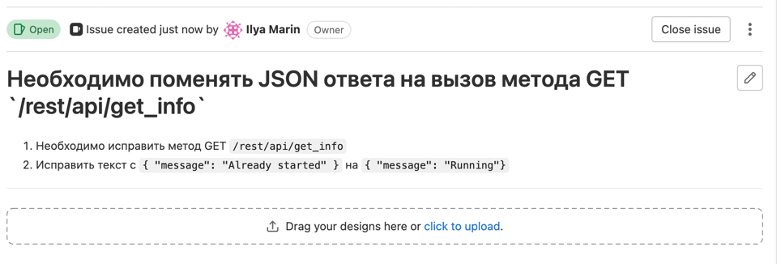
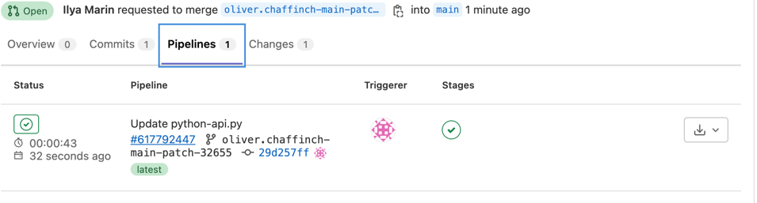
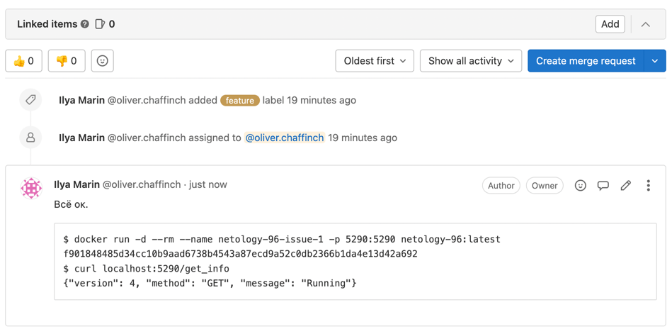
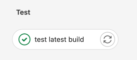
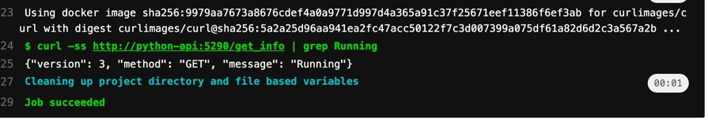

# Домашнее задание к занятию "09.06 Gitlab"

В репозитории содержится код проекта на python. Проект - RESTful API сервис. Ваша задача автоматизировать сборку образа с выполнением python-скрипта:
1. Образ собирается на основе [centos:7](https://hub.docker.com/_/centos?tab=tags&page=1&ordering=last_updated)
2. Python версии не ниже 3.7
3. Установлены зависимости: `flask` `flask-jsonpify` `flask-restful`
4. Создана директория `/python_api`
5. Скрипт из репозитория размещён в /python_api
6. Точка вызова: запуск скрипта
7. Если сборка происходит на ветке `master`: Образ должен пушится в docker registry вашего gitlab `python-api:latest`, иначе этот шаг нужно пропустить

[Dockerfile](https://gitlab.com/oliver.chaffinch/netology-96/-/blob/main/Dockerfile)

[python-api.py](https://gitlab.com/oliver.chaffinch/netology-96/-/blob/main/python-api.py)

[.gitlab-ci.yml](https://gitlab.com/oliver.chaffinch/netology-96/-/blob/main/.gitlab-ci.yml)

### Product Owner

Вашему проекту нужна бизнесовая доработка: необходимо поменять JSON ответа на вызов метода GET `/rest/api/get_info`, необходимо создать Issue в котором указать:
1. Какой метод необходимо исправить
2. Текст с `{ "message": "Already started" }` на `{ "message": "Running"}`
3. Issue поставить label: feature



[Ссылка на Issue](https://gitlab.com/oliver.chaffinch/netology-96/-/issues/1)


### Developer

Вам пришел новый Issue на доработку, вам необходимо:
1. Создать отдельную ветку, связанную с этим issue
2. Внести изменения по тексту из задания
3. Подготовить Merge Requst, влить необходимые изменения в `master`, проверить, что сборка прошла успешно



[Коммит](https://gitlab.com/oliver.chaffinch/netology-96/-/commit/29d257ffed9e9a5d82bbf3843256833dfa870849)

[MergeRequest](https://gitlab.com/oliver.chaffinch/netology-96/-/merge_requests/2)

### Tester

Разработчики выполнили новый Issue, необходимо проверить валидность изменений:
1. Поднять докер-контейнер с образом `python-api:latest` и проверить возврат метода на корректность
2. Закрыть Issue с комментарием об успешности прохождения, указав желаемый результат и фактически достигнутый



```bash
$ docker run -d --rm --name netology-96-issue-1 -p 5290:5290 netology-96:latest
f901848485d34cc10b9aad6738b4543a87ecd9a52c0db2366b1da4e13d42a692
$ curl localhost:5290/get_info
{"version": 4, "method": "GET", "message": "Running"}
```

</details>  

[Ссылка на комментарий на GitLab](https://gitlab.com/oliver.chaffinch/netology-96/-/issues/1#note_1070503650)

## Итог

> После успешного прохождения всех ролей - отправьте ссылку на ваш проект в гитлаб, как решение домашнего задания

https://gitlab.com/oliver.chaffinch/netology-96

## Необязательная часть

> Автомазируйте работу тестировщика, пусть у вас будет отдельный конвейер, который автоматически поднимает контейнер и выполняет проверку, например, при помощи curl. На основе вывода - будет приниматься решение об успешности прохождения тестирования

[Дополненный код ci файла для теста](screens/img_5.png)


