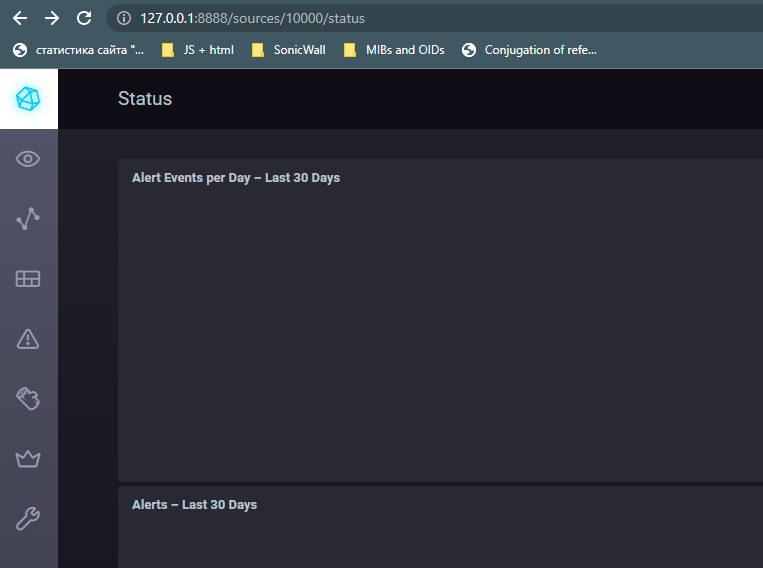
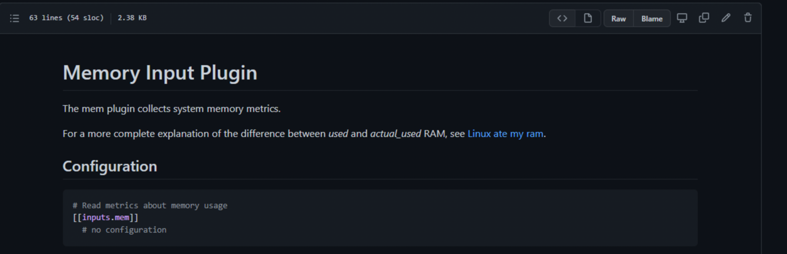
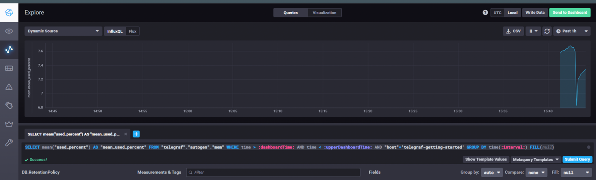
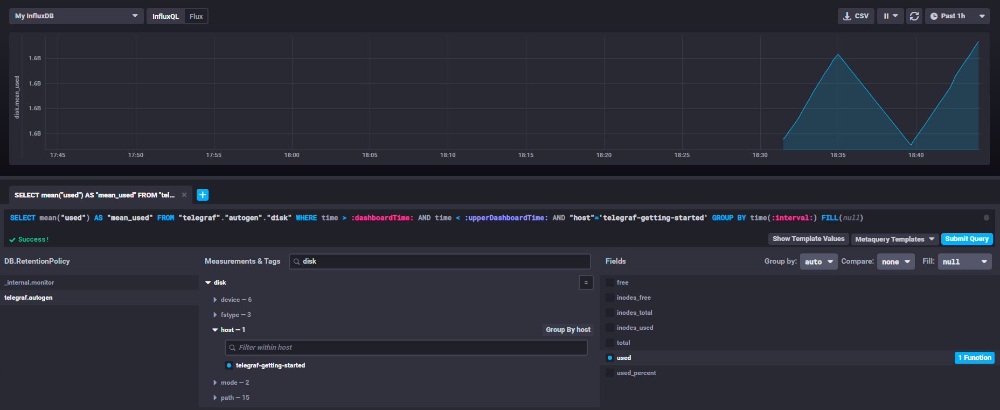
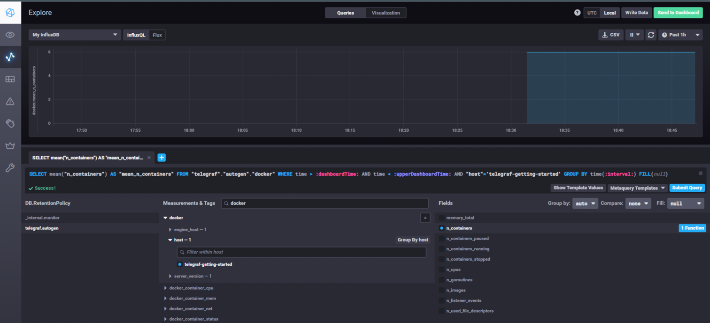
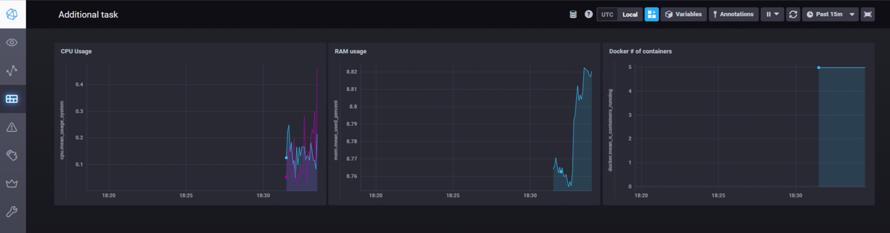

# Домашнее задание к занятию "10.02. Системы мониторинга"

## Обязательные задания

1. Опишите основные плюсы и минусы pull и push систем мониторинга.
Pull модель.  
Плюсы:
* Агенты не требуются;
* Легче контроллировать подлинность данных, т.к. сам сервер их собирает;
* Возможность использовать прокси для того, чтобы попасть во внутренний контур компании и через него собирать метрики с внутренней инфаструктуры;
* Упрощённая отладка получения данных с агентов;

Минусы:
* Нагрузка на сервер возрастает, т.к. все операции проходят на нём;
* Если сервер отказывает - метрики перестают собираться;

Push модель.  
Плюсы:  
* UDP увеличивает производительность системы
* Индивидуальная настройка агентов позволяет накапливать и отправлять метрики по заданным параметрам;
* Подходит для случаев с нестабильным интернет соединениям
* Разгрузка сервера, т.к. данные собираются и первично обрабатываются агентом
* В случае отказа сервера агенты могут продолжать собирать данные, обеспечивая полноту картины. Отправка будет происходить, когда сервер снова будет доступен;

Минусы:
* Необходим агенты;
* Отсутствует гарантия доставки пакетов;
* Возможны большие очереди, если много агентов будут одновременно слать инфу, а сервер не будет справляться с нагрузкой;


2. Какие из ниже перечисленных систем относятся к push модели, а какие к pull? А может есть гибридные?

    - Prometheus - гибридна (с добавлением PushGateway), и pull по-умолчанию;
    - TICK - push по-умолчанию, но также поддерживает гибридную модель;
    - Zabbix - гибридная;
    - VictoriaMetrics - согласно информации с сайта Percona - гибридная система;
    - Nagios - гибридная: как Zabbix может собирать метрики в Active\Passive режимах;

Я думаю, что вряд ли остались системы, которые не могут быть гибридными, т.к. это неоспоримый плюс при выборе решения. Вопрос сохраняется в том, что система предоставляет из коробки, без доп. настроек и подключаемых плагинов.

3. Склонируйте себе [репозиторий](https://github.com/influxdata/sandbox/tree/master) и запустите TICK-стэк, 
используя технологии docker и docker-compose.

В виде решения на это упражнение приведите выводы команд с вашего компьютера (виртуальной машины):

    - curl http://localhost:8086/ping
    - curl http://localhost:8888
    - curl http://localhost:9092/kapacitor/v1/ping
```shell
ilyamarin@mr-chaffinch-macbook sandbox % curl http://localhost:8086/ping -v
*   Trying 127.0.0.1:8086...
* TCP_NODELAY set
* Connected to localhost (127.0.0.1) port 8086 (#0)
> GET /ping HTTP/1.1
> Host: localhost:8086
> User-Agent: curl/7.68.0
> Accept: */*
>
* Mark bundle as not supporting multiuse
< HTTP/1.1 204 No Content
< Content-Type: application/json
< Request-Id: 8c5f6f7e-b346-11ec-803d-0242ac120004
< X-Influxdb-Build: OSS
< X-Influxdb-Version: 1.8.10
< X-Request-Id: 8c5f6f7e-b346-11ec-803d-0242ac120004
< Date: Sun, 03 Apr 2022 12:06:52 GMT
<
* Connection #0 to host localhost left intact


ilyamarin@mr-chaffinch-macbook sandbox % curl http://localhost:8888 -v
*   Trying 127.0.0.1:8888...
* TCP_NODELAY set
* Connected to localhost (127.0.0.1) port 8888 (#0)
> GET / HTTP/1.1
> Host: localhost:8888
> User-Agent: curl/7.68.0
> Accept: */*
>
* Mark bundle as not supporting multiuse
< HTTP/1.1 200 OK
< Accept-Ranges: bytes
< Cache-Control: public, max-age=3600
< Content-Length: 336
< Content-Security-Policy: script-src 'self'; object-src 'self'
< Content-Type: text/html; charset=utf-8
< Etag: "3362220244"
< Last-Modified: Tue, 22 Mar 2022 20:02:44 GMT
< Vary: Accept-Encoding
< X-Chronograf-Version: 1.9.4
< X-Content-Type-Options: nosniff
< X-Frame-Options: SAMEORIGIN
< X-Xss-Protection: 1; mode=block
< Date: Sun, 03 Apr 2022 12:07:39 GMT
<
* Connection #0 to host localhost left intact
<!DOCTYPE html><html><head><meta http-equiv="Content-type" content="text/html; charset=utf-8"><title>Chronograf</title><link rel="icon shortcut" href="/favicon.fa749080.ico"><link rel="stylesheet" href="/src.9cea3e4e.css"></head><body> <div id="react-root" data-basepath=""></div> <script src="/src.a969287c.js"></script> </body></html>

ilyamarin@mr-chaffinch-macbook sandbox % curl http://localhost:9092/kapacitor/v1/ping -v
*   Trying 127.0.0.1:9092...
* TCP_NODELAY set
* Connected to localhost (127.0.0.1) port 9092 (#0)
> GET /kapacitor/v1/ping HTTP/1.1
> Host: localhost:9092
> User-Agent: curl/7.68.0
> Accept: */*
>
* Mark bundle as not supporting multiuse
< HTTP/1.1 204 No Content
< Content-Type: application/json; charset=utf-8
< Request-Id: b4e8f144-b346-11ec-803e-000000000000
< X-Kapacitor-Version: 1.6.4
< Date: Sun, 03 Apr 2022 12:08:00 GMT
<
* Connection #0 to host localhost left intact
```

А также скриншот веб-интерфейса ПО chronograf (`http://localhost:8888`).  



P.S.: если при запуске некоторые контейнеры будут падать с ошибкой - проставьте им режим `Z`, например
`./data:/var/lib:Z`

4. Перейдите в веб-интерфейс Chronograf (`http://localhost:8888`) и откройте вкладку `Data explorer`.

    - Нажмите на кнопку `Add a query`
    - Изучите вывод интерфейса и выберите БД `telegraf.autogen`
    - В `measurments` выберите mem->host->telegraf_container_id , а в `fields` выберите used_percent. 
    Внизу появится график утилизации оперативной памяти в контейнере telegraf.
    - Вверху вы можете увидеть запрос, аналогичный SQL-синтаксису. 
    Поэкспериментируйте с запросом, попробуйте изменить группировку и интервал наблюдений.

Для выполнения задания приведите скриншот с отображением метрик утилизации места на диске 
(disk->host->telegraf_container_id) из веб-интерфейса.  
  
В конфигурации по-умолчанию не было плагина для работы с памятью. На официальном гит ресурсе есть следующая информация:  

Добавил в ``telegraf/telegraf.conf``, который используется для настроек утилиты параметры ``[[inputs.mem]]`` и ``[[inputs.disk]]``. Перезагрузил систему при помощи ``./sandbox restart`` и получил график по памяти:  
  
Запрос получился вида:
```sql
SELECT mean("used_percent") AS "mean_used_percent" FROM "telegraf"."autogen"."mem" WHERE time > :dashboardTime: AND time < :upperDashboardTime: AND "host"='telegraf-getting-started' GROUP BY time(:interval:) FILL(null)
```
Если я правильно понял смысл задачи, то нужно представить вот этот скриншот:  
  


5. Изучите список [telegraf inputs](https://github.com/influxdata/telegraf/tree/master/plugins/inputs). 
Добавьте в конфигурацию telegraf следующий плагин - [docker](https://github.com/influxdata/telegraf/tree/master/plugins/inputs/docker):
```
[[inputs.docker]]
  endpoint = "unix:///var/run/docker.sock"
```

Дополнительно вам может потребоваться донастройка контейнера telegraf в `docker-compose.yml` дополнительного volume и 
режима privileged:
```
  telegraf:
    image: telegraf:1.4.0
    privileged: true
    volumes:
      - ./etc/telegraf.conf:/etc/telegraf/telegraf.conf:Z
      - /var/run/docker.sock:/var/run/docker.sock:Z
    links:
      - influxdb
    ports:
      - "8092:8092/udp"
      - "8094:8094"
      - "8125:8125/udp"
```

После настройке перезапустите telegraf, обновите веб интерфейс и приведите скриншотом список `measurments` в 
веб-интерфейсе базы telegraf.autogen . Там должны появиться метрики, связанные с docker.  
  
Сделал всё, согласно описанию, но метрики не появлялись. Потратил несколько часов на поиски решения, в результате изменил права на ``/var/run/docker.sock``:
```shell
sudo chmod 666 /var/run/docker.sock
```
После чего метрики появились:  



Факультативно можете изучить какие метрики собирает telegraf после выполнения данного задания.

## Дополнительное задание (со звездочкой*) - необязательно к выполнению

В веб-интерфейсе откройте вкладку `Dashboards`. Попробуйте создать свой dashboard с отображением:

    - утилизации ЦПУ
    - количества использованного RAM
    - утилизации пространства на дисках
    - количество поднятых контейнеров
    - аптайм
    - ...
    - фантазируйте)
    
    ---  
Создал произвольный дашбор с несколькими параметрами:  
