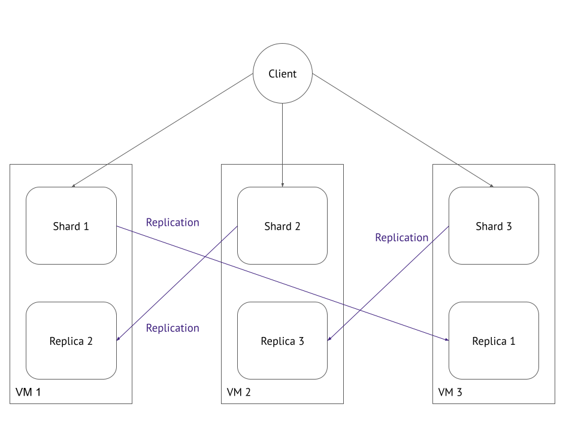

# Домашнее задание к занятию "11.04 Микросервисы: масштабирование"

Вы работаете в крупной компанию, которая строит систему на основе микросервисной архитектуры.
Вам как DevOps специалисту необходимо выдвинуть предложение по организации инфраструктуры, для разработки и эксплуатации.

## Задача 1: Кластеризация

Предложите решение для обеспечения развертывания, запуска и управления приложениями.
Решение может состоять из одного или нескольких программных продуктов и должно описывать способы и принципы их взаимодействия.

Решение должно соответствовать следующим требованиям:
- Поддержка контейнеров;
- Обеспечивать обнаружение сервисов и маршрутизацию запросов;
- Обеспечивать возможность горизонтального масштабирования;
- Обеспечивать возможность автоматического масштабирования;
- Обеспечивать явное разделение ресурсов доступных извне и внутри системы;
- Обеспечивать возможность конфигурировать приложения с помощью переменных среды, в том числе с возможностью безопасного хранения чувствительных данных таких как пароли, ключи доступа, ключи шифрования и т.п.

При всей сложности и громоздкости лучшим решением будет Kubernetes.  
Он поддерживает все современные средства контейнеризации на основе docker, containerd, cri-o и т.д. Обнаружение происходит на уровне DNS и kube-proxy. Масштабирование осуществляется при помощи HPA (horizontal pod autoscaling). Разделение осуществляется при помощи компонентов ingress и балансировщика нагрузок. Переменные среды задаются в явном виде при помощи env, также поддерживается работа с секретами (передача конфиденальных данных).  
    
Существует огромое количество связок, которые делают тоже самое. Например, связка Nomad + Consul. Однако, в текущих реалиях и отказа части вендоров для работы на территории РФ я не вижу смысла рассматривать это решение. Если есть возможность остаться в рамках одной экосистемы - это лучшее решение.  

## Задача 2: Распределенный кэш * (необязательная)

Разработчикам вашей компании понадобился распределенный кэш для организации хранения временной информации по сессиям пользователей.
Вам необходимо построить Redis Cluster состоящий из трех шард с тремя репликами.

### Схема:

---

### Как оформить ДЗ?

Выполненное домашнее задание пришлите ссылкой на .md-файл в вашем репозитории.

---