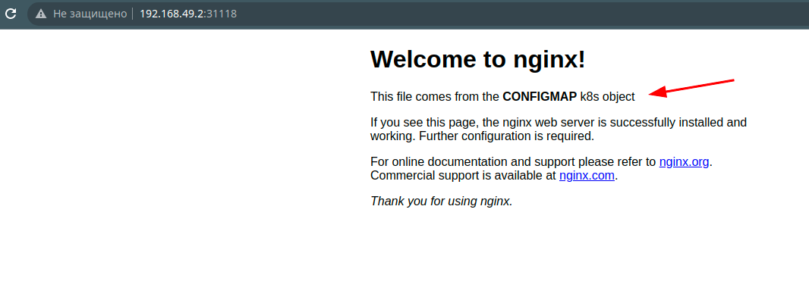

# Домашнее задание к занятию "14.3 Карты конфигураций"

## Задача 1: Работа с картами конфигураций через утилиту kubectl в установленном minikube

Выполните приведённые команды в консоли. Получите вывод команд. Сохраните
задачу 1 как справочный материал.

### Как создать карту конфигураций?

```
kubectl create configmap nginx-config --from-file=nginx.conf
kubectl create configmap domain --from-literal=name=netology.ru
```

### Как просмотреть список карт конфигураций?

```
kubectl get configmaps
kubectl get configmap
```

### Как просмотреть карту конфигурации?

```
kubectl get configmap nginx-config
kubectl describe configmap domain
```

### Как получить информацию в формате YAML и/или JSON?

```
kubectl get configmap nginx-config -o yaml
kubectl get configmap domain -o json
```

### Как выгрузить карту конфигурации и сохранить его в файл?

```
kubectl get configmaps -o json > configmaps.json
kubectl get configmap nginx-config -o yaml > nginx-config.yml
```

### Как удалить карту конфигурации?

```
kubectl delete configmap nginx-config
```

### Как загрузить карту конфигурации из файла?

```
kubectl apply -f nginx-config.yml
```

## Задача 2 (*): Работа с картами конфигураций внутри модуля

Выбрать любимый образ контейнера, подключить карты конфигураций и проверить
их доступность как в виде переменных окружения, так и в виде примонтированного
тома

---

## Решение

Создадим 2 объекта configmap:
```
kubectl create configmap nginx-config --from-file=14.3/nginx.conf
kubectl create configmap domain --from-literal=name=netology.ru
```
Удостоверимся, что они появились:
```
kubectl get cm
NAME               DATA   AGE
domain             1      2s
kube-root-ca.crt   1      57d
nginx-config       1      14s
```

Перейдём к заданию 2.  
Создадим поочерёдно все требуемые сущности (2 объекта configmap и service), применив ``kubectl apply -f``, а также создадим объект configMap из файла ``kubectl create configmap cm-nginx --from-file index.html``. Проверим вывод:
```
kubectl get po,cm,svc
NAME        READY   STATUS    RESTARTS   AGE
pod/nginx   1/1     Running   0          5m

NAME                         DATA   AGE
configmap/cm-env             2      24m
configmap/cm-nginx           1      11m
configmap/kube-root-ca.crt   1      57d

NAME                         TYPE        CLUSTER-IP       EXTERNAL-IP   PORT(S)        AGE
service/kubernetes           ClusterIP   10.96.0.1        <none>        443/TCP        57d
service/nodeport-for-nginx   NodePort    10.107.175.164   <none>        80:31118/TCP   24m
```

Удостоверимся в том, что переменные оружения попали внутрь контейнера:
```
kubectl exec -it nginx -- bash
root@nginx:/# echo $phrase1
Hello
root@nginx:/# echo $phrase2
World
```
Проверим, что отображение стандартного приветствия от nginx изменено, перейдя по адресу узла и добавив nodePort:  

---
