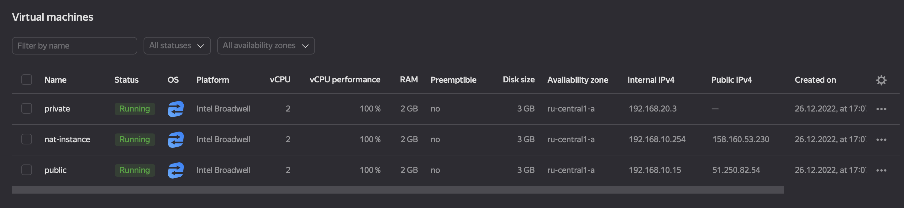
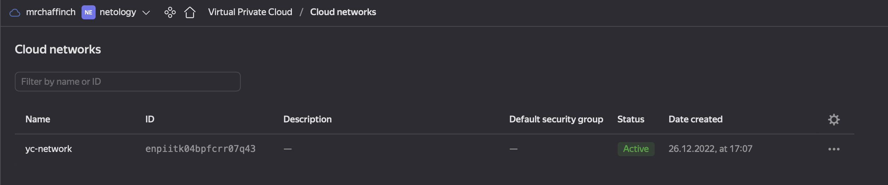
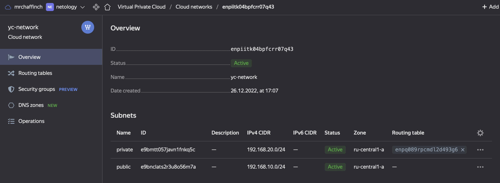
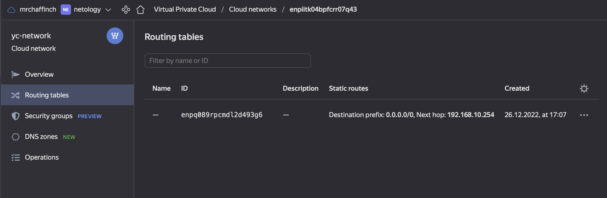

# Домашнее задание к занятию "15.1. Организация сети"
---
## Задание 1. Яндекс.Облако (обязательное к выполнению)

1. Создать VPC.
- Создать пустую VPC. Выбрать зону.
2. Публичная подсеть.
- Создать в vpc subnet с названием public, сетью 192.168.10.0/24.
- Создать в этой подсети NAT-инстанс, присвоив ему адрес 192.168.10.254. В качестве image_id использовать fd80mrhj8fl2oe87o4e1
- Создать в этой публичной подсети виртуалку с публичным IP и подключиться к ней, убедиться что есть доступ к интернету.
3. Приватная подсеть.
- Создать в vpc subnet с названием private, сетью 192.168.20.0/24.
- Создать route table. Добавить статический маршрут, направляющий весь исходящий трафик private сети в NAT-инстанс
- Создать в этой приватной подсети виртуалку с внутренним IP, подключиться к ней через виртуалку, созданную ранее и убедиться что есть доступ к интернету

Resource terraform для ЯО
- [VPC subnet](https://registry.terraform.io/providers/yandex-cloud/yandex/latest/docs/resources/vpc_subnet)
- [Route table](https://registry.terraform.io/providers/yandex-cloud/yandex/latest/docs/resources/vpc_route_table)
- [Compute Instance](https://registry.terraform.io/providers/yandex-cloud/yandex/latest/docs/resources/compute_instance)
---
## Решение.
Создал конфигурационные манифесты для терраформ (программу установил при помощи зеркала яндекс). В результате запуска получил следующую картину:  

Созданные виртуальные машины:  
  
  
Созданная VPC:  
  

Созданные подсети:  
  

Созданная таблица маршрутизации:  


В результате смог подключиться к виртуальной машине по ssh, используя пользователя ``ubuntu``, заданного в инструкции ``metadata``, для проброса SSH ключей:
```bash
ilyamarin@mr-chaffinch-macbook 15-kubernetes-cloud-01-cloud-provider % ssh ubuntu@51.250.82.54
The authenticity of host '51.250.82.54 (51.250.82.54)' can't be established.
ED25519 key fingerprint is SHA256:UfLSg4ooZgc0GriZafRzR/32oC9tpOev8HpdqYRJhZI.
This key is not known by any other names
Are you sure you want to continue connecting (yes/no/[fingerprint])? yes
Warning: Permanently added '51.250.82.54' (ED25519) to the list of known hosts.
Welcome to Ubuntu 18.04.1 LTS (GNU/Linux 4.15.0-29-generic x86_64)

 * Documentation:  https://help.ubuntu.com
 * Management:     https://landscape.canonical.com
 * Support:        https://ubuntu.com/advantage


#################################################################
This instance runs Yandex.Cloud Marketplace product
Please wait while we configure your product...

Documentation for Yandex Cloud Marketplace images available at https://cloud.yandex.ru/docs

#################################################################


The programs included with the Ubuntu system are free software;
the exact distribution terms for each program are described in the
individual files in /usr/share/doc/*/copyright.

Ubuntu comes with ABSOLUTELY NO WARRANTY, to the extent permitted by
applicable law.

To run a command as administrator (user "root"), use "sudo <command>".
See "man sudo_root" for details.

_____________________________________________________________________
WARNING! Your environment specifies an invalid locale.
 The unknown environment variables are:
   LC_CTYPE=UTF-8 LC_ALL=
 This can affect your user experience significantly, including the
 ability to manage packages. You may install the locales by running:

   sudo apt-get install language-pack-UTF-8
     or
   sudo locale-gen UTF-8

To see all available language packs, run:
   apt-cache search "^language-pack-[a-z][a-z]$"
To disable this message for all users, run:
   sudo touch /var/lib/cloud/instance/locale-check.skip
_____________________________________________________________________

ubuntu@fhmpc6t56clcgefpgc32:~$
```
При помощи конфига для прокидывания ssh заходим на приватную тачку:
```bash
ilyamarin@mr-chaffinch-macbook devops-netology % cat ~/.ssh/config 
Host private
 User ubuntu
 Hostname 192.168.20.3
 IdentityFile ~/.ssh/id_rsa
 ProxyCommand ssh -i ~/.ssh/id_rsa -W %h:%p ubuntu@51.250.82.54
```
```bash
ilyamarin@mr-chaffinch-macbook .ssh % ssh private
The authenticity of host '192.168.20.3 (<no hostip for proxy command>)' can't be established.
ED25519 key fingerprint is SHA256:kCjYdzn398C/YJgtF+r19RqpM/31ExyBNpEH9lgwDoQ.
This key is not known by any other names
Are you sure you want to continue connecting (yes/no/[fingerprint])? yes
Warning: Permanently added '192.168.20.3' (ED25519) to the list of known hosts.
Welcome to Ubuntu 18.04.1 LTS (GNU/Linux 4.15.0-29-generic x86_64)

 * Documentation:  https://help.ubuntu.com
 * Management:     https://landscape.canonical.com
 * Support:        https://ubuntu.com/advantage


#################################################################
This instance runs Yandex.Cloud Marketplace product
Please wait while we configure your product...

Documentation for Yandex Cloud Marketplace images available at https://cloud.yandex.ru/docs

#################################################################


The programs included with the Ubuntu system are free software;
the exact distribution terms for each program are described in the
individual files in /usr/share/doc/*/copyright.

Ubuntu comes with ABSOLUTELY NO WARRANTY, to the extent permitted by
applicable law.

To run a command as administrator (user "root"), use "sudo <command>".
See "man sudo_root" for details.

_____________________________________________________________________
WARNING! Your environment specifies an invalid locale.
 The unknown environment variables are:
   LC_CTYPE=UTF-8 LC_ALL=
 This can affect your user experience significantly, including the
 ability to manage packages. You may install the locales by running:

   sudo apt-get install language-pack-UTF-8
     or
   sudo locale-gen UTF-8

To see all available language packs, run:
   apt-cache search "^language-pack-[a-z][a-z]$"
To disable this message for all users, run:
   sudo touch /var/lib/cloud/instance/locale-check.skip
_____________________________________________________________________

ubuntu@fhmiq6ssrj7p2c2b566r:~$ ip a
1: lo: <LOOPBACK,UP,LOWER_UP> mtu 65536 qdisc noqueue state UNKNOWN group default qlen 1000
    link/loopback 00:00:00:00:00:00 brd 00:00:00:00:00:00
    inet 127.0.0.1/8 scope host lo
       valid_lft forever preferred_lft forever
    inet6 ::1/128 scope host
       valid_lft forever preferred_lft forever
2: eth0: <BROADCAST,MULTICAST,UP,LOWER_UP> mtu 1500 qdisc mq state UP group default qlen 1000
    link/ether d0:0d:12:d1:b9:cd brd ff:ff:ff:ff:ff:ff
    inet 192.168.20.3/24 brd 192.168.20.255 scope global eth0
       valid_lft forever preferred_lft forever
    inet6 fe80::d20d:12ff:fed1:b9cd/64 scope link
       valid_lft forever preferred_lft forever
ubuntu@fhmiq6ssrj7p2c2b566r:~$ ping 8.8.8.8
PING 8.8.8.8 (8.8.8.8) 56(84) bytes of data.
64 bytes from 8.8.8.8: icmp_seq=1 ttl=59 time=23.0 ms
64 bytes from 8.8.8.8: icmp_seq=2 ttl=59 time=21.3 ms
64 bytes from 8.8.8.8: icmp_seq=3 ttl=59 time=21.3 ms
^C
--- 8.8.8.8 ping statistics ---
3 packets transmitted, 3 received, 0% packet loss, time 2002ms
rtt min/avg/max/mdev = 21.353/21.943/23.091/0.820 ms
ubuntu@fhmiq6ssrj7p2c2b566r:~$
```
Если менять правило маршрутизации (например изменить на 0.0.0.0/24) - пинг 8.8.8.8 становится невозможным. 

---