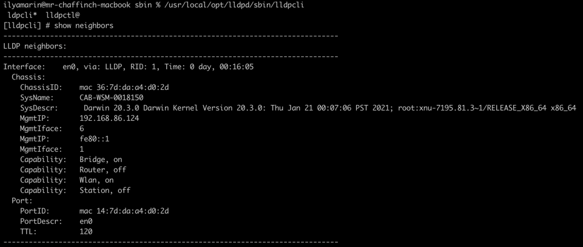

Homework 3.7

#1
Для того, что узнать список интерфейсов можно просто набрать ifconfig - для Linux, ipconfig - для Windows

#2
Для распознавания соседа используется протокол lldp или CDP (для циско), пакет для Linux называется lldpd 

К примеру посмотреть соседа можно командой: \
show neighbors

выглядеть это будет так:

#3
Для логического разделения подсетей используется так называемый Vlan. Пакет для Linux называется vlan. \
Для установки надо ввести: \
sudo apt-get install vlan - непосредственно сам пакет \
sudo modprobe 8021q - так же включаем модуль ядра для поддержки vlan \
Далее создаём виртуальный интерфейс: \
sudo ip link add link eth0 name eth0.861 type vlan id 861 \
sudo ip addr add 10.10.10.23/24 dev eth0.861 - добавляем ip для данного виртуального интерфейса \
Либо это можно сделать через конфиг самого интерфейса: ё
auto eth0.861 \
iface eth0.861 inet static \
    address 10.10.10.23 \
    netmask 255.255.255.0 \
    vlan-raw-device eth0

#4
В Linux используется bonding, это позволяет работать нескольким интерфейсам, как один логический. \
Виды балансировки: \
Balance rr (0) – балансировка round-robin, пакеты отправляются по очереди \

802.3ad (4) – агрегирование интерфейсов, создается группа интерфейсов, при приеме и передаче используются все линки, таким образом, увеличивается пропускная способность канала. \

Active backup (1) – активный-резервный, при такой политике один линк активный и пакеты отправляются через него, остальные в это время не работают. \
 
Balance tlb (5) — Политика адаптивной балансировки нагрузки передачи. Исходящий трафик распределяется в зависимости от загруженности каждого порта (определяется скоростью загрузки). Входящий трафик приходит на активный линк. Если он выходит из строя, то другой порт берёт себе MAC адрес вышедшего из строя. \

balance-alb (6)  — политика  в основном такой же, как balance-tlb, но входящий трафик также сбалансирован. \

balance-xor (2) — Этот режим уравновешивает исходящий трафик через активные линки на основе хешированной информации заголовка протокола и принимает входящий трафик от любого активного линка. \

broadcast (3) — Все пакеты передаются на все линки. Политика  обеспечивает отказоустойчивость. Это политика не обеспечивает балансировку нагрузки. \

Привет конфига: \
auto bond0 \
iface bond0 inet static \
address 10.10.10.2 \
netmask 255.255.255.0 \
gateway 10.10.10.1 \
   slaves eth0 eht1 \
   bond_mode (выбираем метод из описанных выше) \
   bond-miimon 100 \
   bond_downdelay 0 \
   bond_updelay 0 \

auto eth0 \
iface eth0 inet manual \
auto eth1 \
iface eth1 inet manual 

#5
Самый простой вариант, это просто разделить кол-во адресов 24 подсети, на кол-во адресов 29 подсети: \
получится 256/8 итого 32 подсети /29 можно поместить в /24.

#6
100.64.0.0/26 - данная сеть не маршрутизируется в интернете. 26 маска позволит уместить 62 хоста

#7
arp -a - просмотр таблицы ARP в Linux \
arp /a - просмотр таблицы ARP в Windows 

чтобы удалить кэш ARP таблицы, необхожимо вполнить: \
ip -s -s neigh flush all

Для того чтобы удалить только 1 нужный ip необходимо выполнить: \
sudo arp -d (some_ip)

