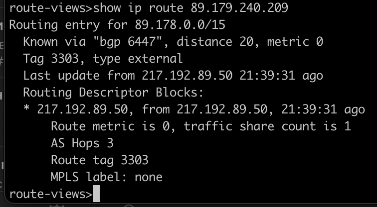
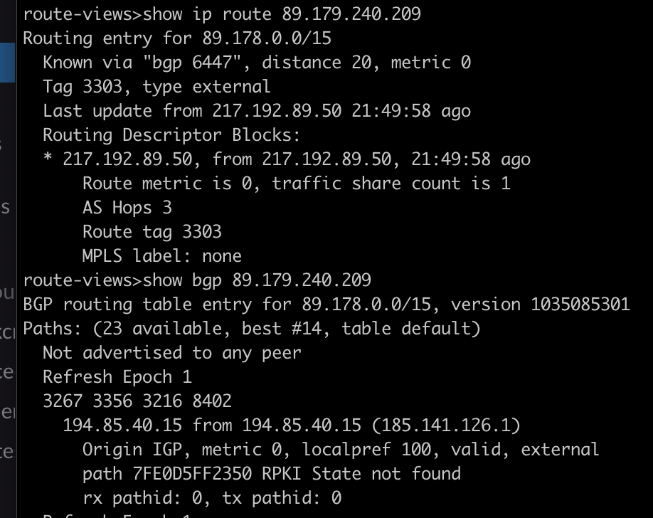
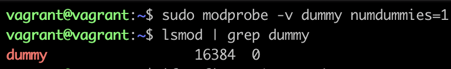
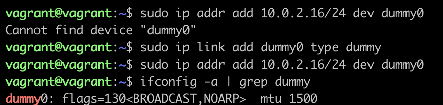
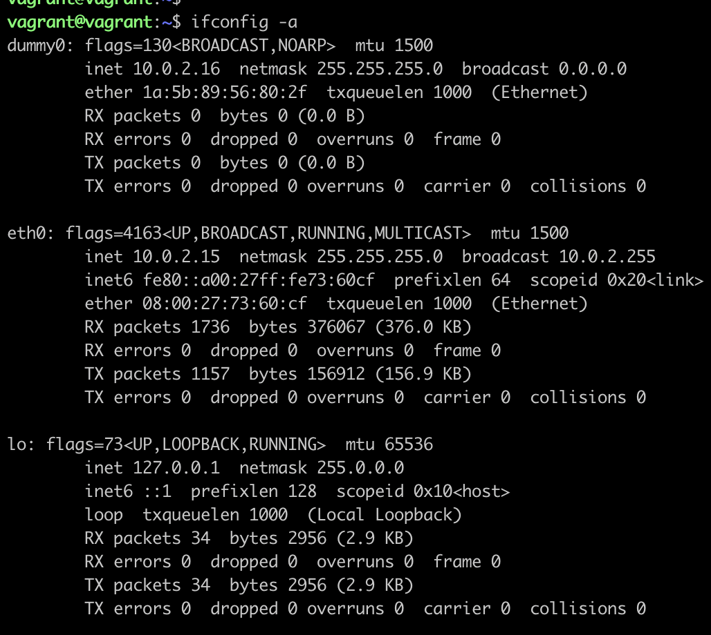
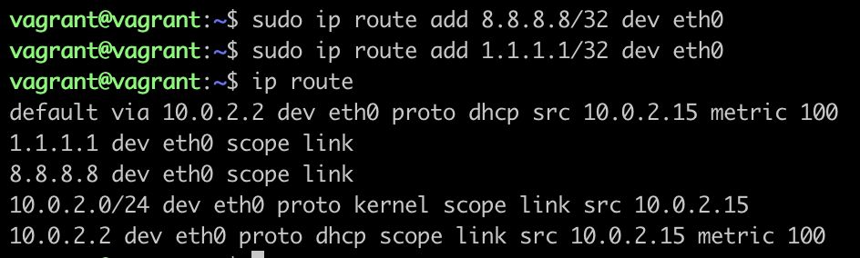
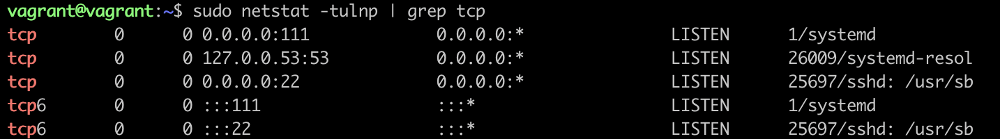
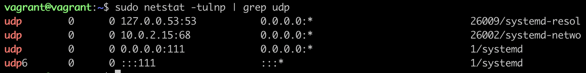
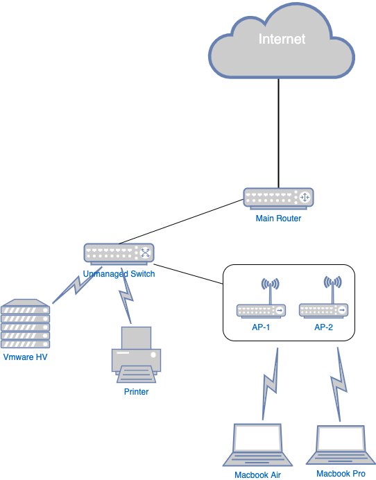

Homework 3.8

#1

#2

#3

К примеру, процесс sshd использует 22 порт для работы ssh сервера для удаленного подключения.

#4

К примеру, процесс systemd-resolved использует 53 порт для резолва имен хостов в локальной сети.

#5
