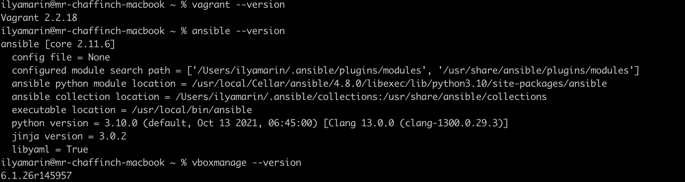
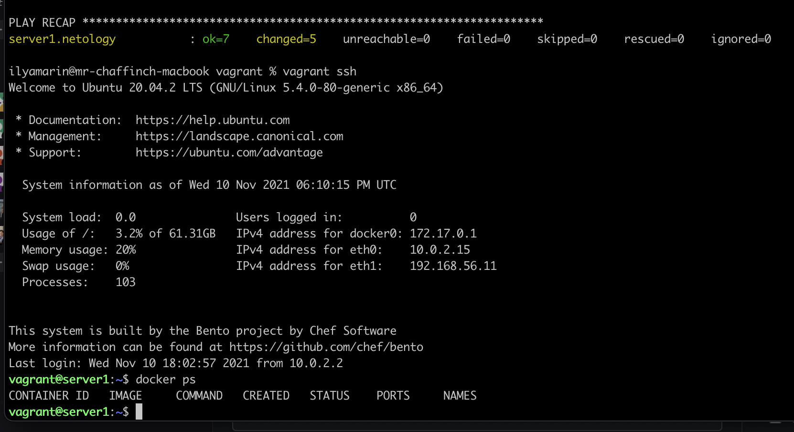

#1
1) Возможность более быстрого вывода продукта потребителю и его новых фич.
2) Единая среда разработки и конфигурации продукта.
3) Автоматизация развёртки разных сред для разработки и обновления продукта.

#2
Плюсы ансибла:
1) Отсутствие клиентской части
2) Всё описание идёт в yaml
3) Описание кода не требует знания языков программирования

Основополагающим фактором IaaC - является идемпонентность, т.е. получать одинаковый результат выполения.

#3

#4
