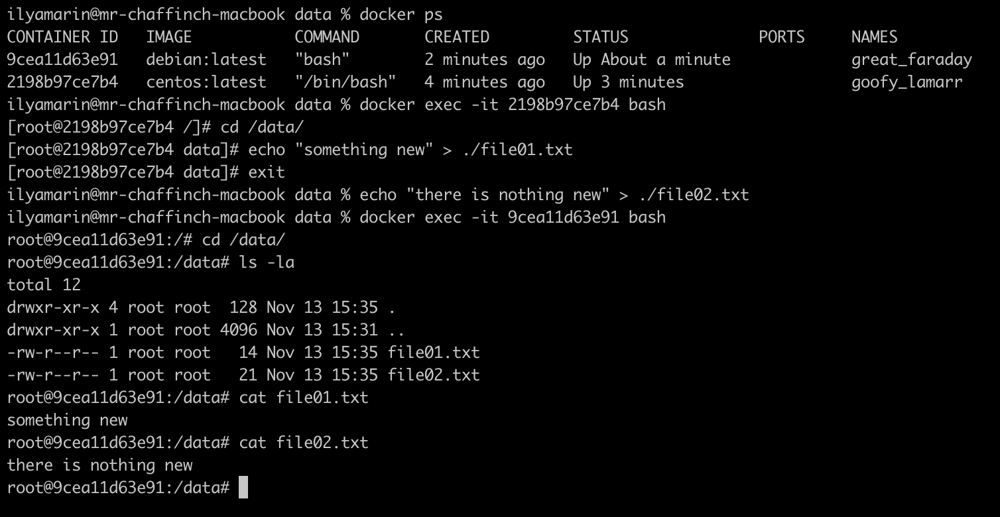

#1
https://hub.docker.com/layers/mrchaffinch/netology/hw5-3.netology/images/sha256-a7f2cdb2eb90a5d604c6e3e1b771faaf99834d5ef8db2abb2c51c025d938d50f?context=repo

#2
Высоконагруженное монолитное java веб-приложение - физ. сервер (возможна большая утилизация ресурсов Java+монолит) \

Nodejs веб-приложение - подойдет контейнер (легко масштабируется и возможна балансировка) \

Мобильное приложение c версиями для Android и iOS - достаточно будет контейнеризации (легко масштабируется и возможна балансировка) \

Шина данных на базе Apache Kafka - под высокие нагрузки желательно выносить на отдельный физ сервер или вм \

Elasticsearch кластер для реализации логирования продуктивного веб-приложения (три ноды elasticsearch, два logstash и две ноды kibana) - \
для данного варианта достаточно будет контейнера или вм (под более высокие нагрузки) \

Мониторинг-стек на базе Prometheus и Grafana - для данного варианта достаточно будет контейнеризации или вм \

MongoDB, как основное хранилище данных для java-приложения - под большой объём и нагрузки лучше использовать вм \

Gitlab сервер для реализации CI/CD процессов и приватный (закрытый) Docker Registry - для команды лучше использовать вм

#3

#4
https://hub.docker.com/layers/mrchaffinch/netology/latest/images/sha256-10efd188baab3ca801b8412a619121af1c6e56822efd05bb66dd80549bf7ac20?context=repo