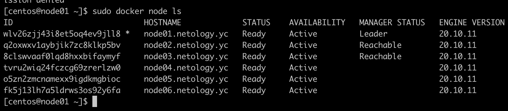
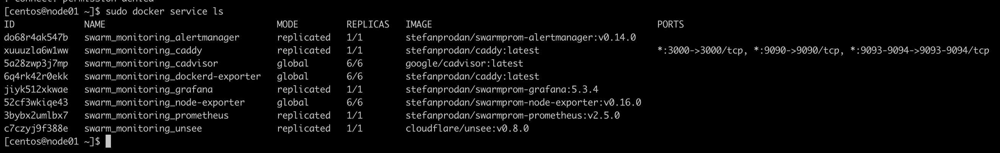

#1
Replication - в данном режиме мы просто указываем сколько реплик контейнера нам делать
Global - в режиме глобал у нас запускается контейнер на всех нодах кластера

Для выбора лидера используется алгоритм Raft

Overlay network - логическая сеть, созданная поверх другой сети. Узлы оверлейной сети могут быть связаны либо физическим соединением, либо логическим.

#2

#3

#4
Данная функционал позволяет обезопаситься из-за особенностей хранения TLS ключа.
После перезапуска докер блокируется. Для дальнейшего его запуска необходим пароль для разблокировки.