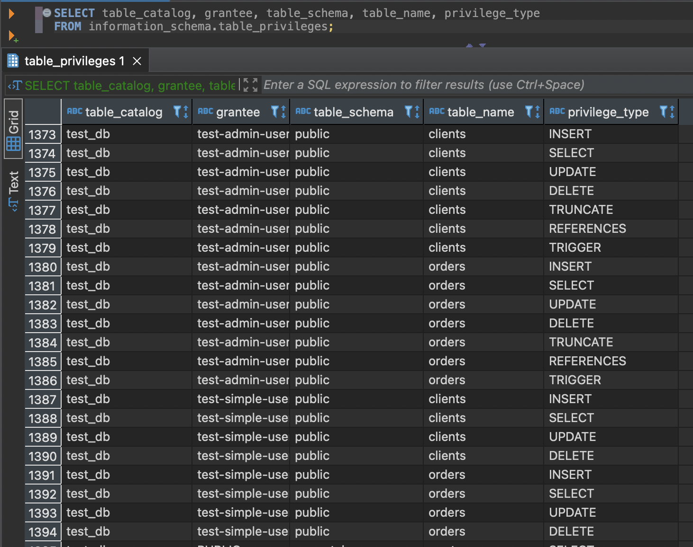
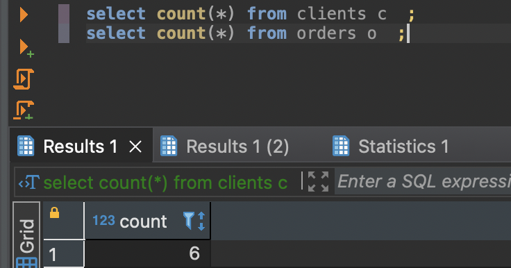
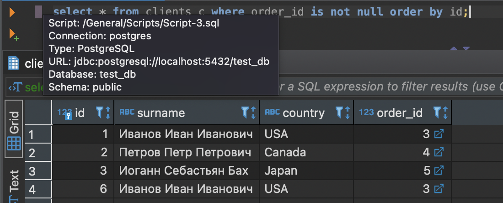
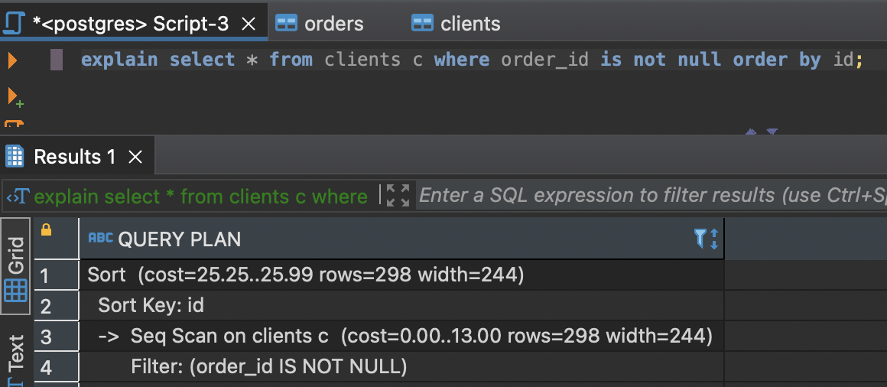

#1
~~~
version: "3.9"
services:
  postgres:
    image: postgres:12
    environment:
      POSTGRES_PASSWORD: "imarin"
      PGDATA: "/var/lib/postgresql/data/pgdata"
    volumes:
      - ./pg_data:/var/lib/postgresql/data
      - ./pg_dump:/backups
    ports:
      - "5432:5432"
~~~

#2

#3
~~~
insert into orders (name, price) values 
('Шоколад', 10),
('Принтер', 3000),
('Книга', 500),
('Монитор', 7000),
('Гитара', 4000);
~~~

~~~
insert into clients (surname, country) values 
('Иванов Иван Иванович', 'USA'),
('Петров Петр Петрович', 'Canada'),
('Иоганн Себастьян Бах', 'Japan'),
('Ронни Джеймс Дио', 'Russia'),
('Ritchie Blackmore', 'Russia'),
('Иванов Иван Иванович', 'USA');
~~~

~~~
select count(*) from clients c  ;
select count(*) from orders o  ;
~~~

#4
~~~
select * from clients c where order_id is not null order by id;
~~~

#5

#6

