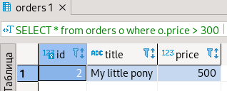

#1
```
version: '3.7'
services:
  db:
    image: mysql:8
    restart: always
    environment:
      MYSQL_DATABASE: 'netology'
      MYSQL_USER: 'imarin'
      MYSQL_PASSWORD: 'password'
      MYSQL_ROOT_PASSWORD: 'password'
    volumes:
      - ./data:/var/lib/mysql
    ports:
      - "3306:3306"
```
Копируем бэкап в ./data, т.е. директорию, которую мы смонтировали в качестве тома \
Заходим в контейнер sudo docker exec -it some_container bash и восстановим данные из бэкапа: mysql -u imarin -p netology < /var/lib/mysql/test_dump.sql 
Подключимся к базе, используя mysql -u imarin -p

```
mysql> SHOW DATABASES;
+--------------------+
| Database           |
+--------------------+
| information_schema |
| netology           |
+--------------------+
2 rows in set (0.00 sec)

mysql> \u netology 
Database changed
mysql> SHOW TABLES FROM netology;
+--------------------+
| Tables_in_netology |
+--------------------+
| orders             |
+--------------------+
1 row in set (0.00 sec)

mysql> \s

--------------
mysql  Ver 8.0.27 for Linux on x86_64 (MySQL Community Server - GPL)
Connection id:		13
Current database:	netology
Current user:		mbagirov@localhost
SSL:			Not in use
Current pager:		stdout
Using outfile:		''
Using delimiter:	;
Server version:		8.0.27 MySQL Community Server - GPL
Protocol version:	10
Connection:		Localhost via UNIX socket
Server characterset:	utf8mb4
Db     characterset:	utf8mb4
Client characterset:	latin1
Conn.  characterset:	latin1
UNIX socket:		/var/run/mysqld/mysqld.sock
Binary data as:		Hexadecimal
Uptime:			35 min 55 sec

Threads: 5  Questions: 109  Slow queries: 0  Opens: 255  Flush tables: 3  Open tables: 173  Queries per second avg: 0.050
--------------

mysql> SELECT * FROM orders;
+----+-----------------------+-------+
| id | title                 | price |
+----+-----------------------+-------+
|  1 | War and Peace         |   100 |
|  2 | My little pony        |   500 |
|  3 | Adventure mysql times |   300 |
|  4 | Server gravity falls  |   300 |
|  5 | Log gossips           |   123 |
+----+-----------------------+-------+
5 rows in set (0.00 sec)
```
SELECT * from orders o where o.price > 300 \


#2
Добавление пользователя test в БД c паролем test-pass:
```
CREATE USER 
'test'@'localhost' IDENTIFIED WITH mysql_native_password by 'test-pass'
PASSWORD EXPIRE INTERVAL 180 DAY
FAILED_LOGIN_ATTEMPTS 3
PASSWORD HISTORY 100
ATTRIBUTE '{"fname": "James","lname": "Pretty"}'; 

GRANT SELECT ON netology.* to 'test'@'localhost';

mysql> SELECT * from INFORMATION_SCHEMA.USER_ATTRIBUTES where USER = 'test';

+------+-----------+---------------------------------------+
| USER | HOST      | ATTRIBUTE                             |
+------+-----------+---------------------------------------+
| test | localhost | {"fname": "James", "lname": "Pretty"} |
+------+-----------+---------------------------------------+
1 row in set (0.00 sec)
```
#3
```
mysql> SET profiling = 1;
Query OK, 0 rows affected, 1 warning (0.00 sec)
mysql> DROP TABLE IF EXISTS t1;
Query OK, 0 rows affected, 1 warning (0.01 sec)

mysql> SHOW PROFILES;

+----------+------------+----------------------------------------------------------------------+
| Query_ID | Duration   | Query                                                                |
+----------+------------+----------------------------------------------------------------------+
|        1 | 0.01576925 | DROP TABLE IF EXISTS t1                                                                  |
|        1 | 0.00046725 | SELECT * from INFORMATION_SCHEMA.USER_ATTRIBUTES where USER = 'test' |
|        2 | 0.00021350 | SELECT * FROM orders                                                 |
|        3 | 0.00023775 | SELECT * FROM orders WHERE price > 300                               |
+----------+------------+----------------------------------------------------------------------+
4 rows in set, 1 warning (0.00 sec)

mysql> SELECT TABLE_NAME, ENGINE FROM information_schema.TABLES where TABLE_SCHEMA = 'netology';
+------------+--------+
| TABLE_NAME | ENGINE |
+------------+--------+
| orders     | InnoDB |
+------------+--------+
1 row in set (0.00 sec)

MyISAM
InnoDB
mysql> SELECT TABLE_NAME, ENGINE FROM information_schema.TABLES where TABLE_SCHEMA = 'netology';

+------------+--------+
| TABLE_NAME | ENGINE |
+------------+--------+
| orders     | InnoDB |
+------------+--------+
1 row in set (0.00 sec)

mysql> ALTER TABLE orders ENGINE = MyIsam;
Query OK, 5 rows affected (0.09 sec)
Records: 5  Duplicates: 0  Warnings: 0


mysql> SELECT TABLE_NAME, ENGINE FROM information_schema.TABLES where TABLE_SCHEMA = 'netology';
+------------+--------+
| TABLE_NAME | ENGINE |
+------------+--------+
| orders     | MyISAM |
+------------+--------+
1 row in set (0.00 sec)

mysql> ALTER TABLE orders ENGINE = InnoDB;
Query OK, 5 rows affected (0.11 sec)
Records: 5  Duplicates: 0  Warnings: 0

mysql> SELECT TABLE_NAME, ENGINE FROM information_schema.TABLES where TABLE_SCHEMA = 'netology';
+------------+--------+
| TABLE_NAME | ENGINE |
+------------+--------+
| orders     | InnoDB |
+------------+--------+
1 row in set (0.00 sec)

mysql> SHOW PROFILES;
+----------+------------+------------------------------------------------------------------------------------------+
| Query_ID | Duration   | Query                                                                                    |
+----------+------------+------------------------------------------------------------------------------------------+
|        2 | 0.00046725 | SELECT * from INFORMATION_SCHEMA.USER_ATTRIBUTES where USER = 'test'                     |
|        3 | 0.00021350 | SELECT * FROM orders                                                                     |
|        4 | 0.00023775 | SELECT * FROM orders WHERE price > 300                                                   |
|        5 | 0.00087925 | SELECT TABLE_NAME, ENGINE FROM information_schema.TABLES where TABLE_SCHEMA = 'netology' |
|        6 | 0.09245425 | ALTER TABLE orders ENGINE = MyIsam                                                       |
|        7 | 0.00089075 | SELECT TABLE_NAME, ENGINE FROM information_schema.TABLES where TABLE_SCHEMA = 'netology' |
|        8 | 0.11460800 | ALTER TABLE orders ENGINE = InnoDB                                                       |
|        9 | 0.00083100 | SELECT TABLE_NAME, ENGINE FROM information_schema.TABLES where TABLE_SCHEMA = 'netology' |
|       10 | 0.00005500 | SHOW PROFILIES                                                                           |
|       11 | 0.00005850 | SHOW PROFILES QUERY 3                                                                    |
|       12 | 0.00005950 | SHOW PROFILES FOR QUERY 3                                                                |
|       13 | 0.00068200 | SELECT TABLE_NAME, ENGINE FROM information_schema.TABLES where TABLE_SCHEMA = 'netology' |
|       14 | 0.00006500 | ALTER TABLE orders ENGINE = MyISAAM                                                      |
|       15 | 0.08200825 | ALTER TABLE orders ENGINE = MyISAM                                                       |
|       16 | 0.00033400 | SELECT * from orders o where o.price > 300                                               |
+----------+------------+------------------------------------------------------------------------------------------+

15 rows in set, 1 warning (0.00 sec)

mysql> SHOW PROFILE FOR QUERY 4;

+--------------------------------+----------+
| Status                         | Duration |
+--------------------------------+----------+
| starting                       | 0.000065 |
| Executing hook on transaction  | 0.000003 |
| starting                       | 0.000006 |
| checking permissions           | 0.000005 |
| Opening tables                 | 0.000033 |
| init                           | 0.000005 |
| System lock                    | 0.000007 |
| optimizing                     | 0.000008 |
| statistics                     | 0.000016 |
| preparing                      | 0.000013 |
| executing                      | 0.000033 |
| end                            | 0.000003 |
| query end                      | 0.000002 |
| waiting for handler commit     | 0.000007 |
| closing tables                 | 0.000005 |
| freeing items                  | 0.000010 |
| cleaning up                    | 0.000020 |
+--------------------------------+----------+
17 rows in set, 1 warning (0.01 sec)

mysql> SHOW PROFILE FOR QUERY 16;
+--------------------------------+----------+
| Status                         | Duration |
+--------------------------------+----------+
| starting                       | 0.000067 |
| Executing hook on transaction  | 0.000003 |
| starting                       | 0.000006 |
| checking permissions           | 0.000005 |
| Opening tables                 | 0.000029 |
| init                           | 0.000004 |
| System lock                    | 0.000008 |
| optimizing                     | 0.000008 |
| statistics                     | 0.000012 |
| preparing                      | 0.000013 |
| executing                      | 0.000063 |
| end                            | 0.000008 |
| query end                      | 0.000005 |
| closing tables                 | 0.000006 |
| freeing items                  | 0.000078 |
| cleaning up                    | 0.000020 |
+--------------------------------+----------+
16 rows in set, 1 warning (0.00 sec)
```
#4
```
root@39e26a4d08а7:/# cat /etc/mysql/my.cnf
# Copyright (c) 2017, Oracle and/or its affiliates. All rights reserved.
#
# This program is free software; you can redistribute it and/or modify
# it under the terms of the GNU General Public License as published by
# the Free Software Foundation; version 2 of the License.
#
# This program is distributed in the hope that it will be useful,
# but WITHOUT ANY WARRANTY; without even the implied warranty of
# MERCHANTABILITY or FITNESS FOR A PARTICULAR PURPOSE.  See the
# GNU General Public License for more details.
#
# You should have received a copy of the GNU General Public License
# along with this program; if not, write to the Free Software
# Foundation, Inc., 51 Franklin St, Fifth Floor, Boston, MA  02110-1301 USA
#
# The MySQL  Server configuration file.
#
# For explanations see
# http://dev.mysql.com/doc/mysql/en/server-system-variables.html

[mysqld]
pid-file        = /var/run/mysqld/mysqld.pid
socket          = /var/run/mysqld/mysqld.sock
datadir         = /var/lib/mysql
secure-file-priv= NULL

# Custom config should go here
!includedir /etc/mysql/conf.d/
```
Добавим параметры через echo [param] >> /etc/mysql/my.cnf.
Перезапустим контейнер и проверим параметры:
```
mysql> SELECT * FROM performance_schema.global_variables WHERE
    -> Variable_name LIKE 'innodb_buffer_pool_size' OR
    -> Variable_name LIKE 'innodb_log_file_size' OR
    -> Variable_name LIKE 'innodb_log_buffer_size' OR
    -> Variable_name LIKE 'innodb_file_per_table' OR
    -> Variable_name LIKE 'innodb_io_capacity' OR
    -> Variable_name LIKE 'innodb_flush_log_at_trx_commit';
+--------------------------------+----------------+
| VARIABLE_NAME                  | VARIABLE_VALUE |
+--------------------------------+----------------+
| innodb_buffer_pool_size        | 671088640      |
| innodb_file_per_table          | ON             |
| innodb_flush_log_at_trx_commit | 2              |
| innodb_io_capacity             | 200            |
| innodb_log_buffer_size         | 1048576        |
| innodb_log_file_size           | 104857600      |
+--------------------------------+----------------+
6 rows in set (0.01 sec)
```