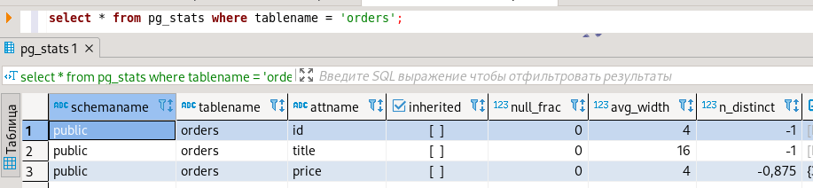
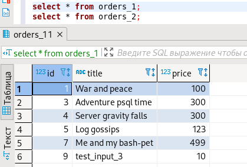
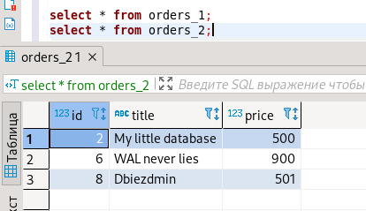

#1
```
postgres=# \l
                                 List of databases
   Name    |  Owner   | Encoding |  Collate   |   Ctype    |   Access privileges   
-----------+----------+----------+------------+------------+-----------------------
 postgres  | postgres | UTF8     | en_US.utf8 | en_US.utf8 | 
 template0 | postgres | UTF8     | en_US.utf8 | en_US.utf8 | =c/postgres          +
           |          |          |            |            | postgres=CTc/postgres
 template1 | postgres | UTF8     | en_US.utf8 | en_US.utf8 | =c/postgres          +
           |          |          |            |            | postgres=CTc/postgres
(3 rows)
```
подключение к БД \c[onnect] {[DBNAME|- USER|- HOST|- PORT|-] | conninfo} connect to new database (currently "postgres") \
вывод списка таблиц - \dt[S+] [PATTERN] list tables \
вывод описания содержимого таблиц - \d[S+] NAME describe table, view, sequence, or index \
выход из psql - \q quit psql \

#2
```
postgres@48762365740a:/$ psql -U postgres -d test_database < /backups/test_dump.sql 

SET
SET
SET
SET
SET
 set_config 
------------

(1 row)
SET
SET
SET
SET
SET
SET
CREATE TABLE
ALTER TABLE
CREATE SEQUENCE
ALTER TABLE
ALTER SEQUENCE
ALTER TABLE
COPY 8
 setval 
--------
      8
(1 row)

ALTER TABLE
```

```
test_database=# ANALYZE verbose orders;
INFO:  analyzing "public.orders"
INFO:  "orders": scanned 1 of 1 pages, containing 8 live rows and 0 dead rows; 8 rows in sample, 8 estimated total rows
ANALYZE

test_database=# ANALYZE verbose;
INFO:  analyzing "public.orders"
INFO:  "orders": scanned 1 of 1 pages, containing 8 live rows and 0 dead rows; 8 rows in sample, 8 estimated total rows
INFO:  analyzing "pg_catalog.pg_type"
INFO:  "pg_type": scanned 10 of 10 pages, containing 414 live rows and 0 dead rows; 414 rows in sample, 414 estimated total rows
INFO:  analyzing "pg_catalog.pg_foreign_table"
INFO:  "pg_foreign_table": scanned 0 of 0 pages, containing 0 live rows and 0 dead rows; 0 rows in sample, 0 estimated total rows
INFO:  analyzing "pg_catalog.pg_authid"
INFO:  "pg_authid": scanned 1 of 1 pages, containing 9 live rows and 0 dead rows; 9 rows in sample, 9 estimated total rows
INFO:  analyzing "pg_catalog.pg_statistic_ext_data"
INFO:  "pg_statistic_ext_data": scanned 0 of 0 pages, containing 0 live rows and 0 dead rows; 0 rows in sample, 0 estimated total rows
INFO:  analyzing "pg_catalog.pg_largeobject"
INFO:  "pg_largeobject": scanned 0 of 0 pages, containing 0 live rows and 0 dead rows; 0 rows in sample, 0 estimated total rows
INFO:  analyzing "pg_catalog.pg_user_mapping"
INFO:  "pg_user_mapping": scanned 0 of 0 pages, containing 0 live rows and 0 dead rows; 0 rows in sample, 0 estimated total rows
INFO:  analyzing "pg_catalog.pg_subscription"
INFO:  "pg_subscription": scanned 0 of 0 pages, containing 0 live rows and 0 dead rows; 0 rows in sample, 0 estimated total rows
.........
```


#3
Создадим новую таблицу, подготовив её к разделению по графе price:
```
create table orders_new (
 id serial,
 title varchar (40),
 price integer
) partition by range (price);
```
Создадим две дочерние таблицы, завязанные на основной:

```
create table orders_1 
partition of orders_new 
for values from (0) to (500);

create table orders_2 
partition of orders_new 
for values from (500) to (maxvalue);
```
Добавим данные из основной таблицы в новую, которую мы подготовили для разделения: insert into orders_new (title, price) select o.title, o.price from orders o;.





Да, прописав правила вставки, например:
```
CREATE RULE orders_insert_to_more AS ON INSERT TO orders WHERE ( price > 500 ) DO INSTEAD INSERT INTO orders_more_499_price VALUES (NEW.*);
CREATE RULE orders_insert_to_less AS ON INSERT TO orders WHERE ( price <= 500 ) DO INSTEAD INSERT INTO orders_less_499_price VALUES (NEW.*);
```

#4
[pg_dump.sql](pg_dump/pg_dump.sql)

Бэкап в формате .sql можно открыть любым текстовым редактором и отредактировать любые поля.

Например, добавить свойство UNIQUE
```
title character varying(80) NOT NULL UNIQUE
```